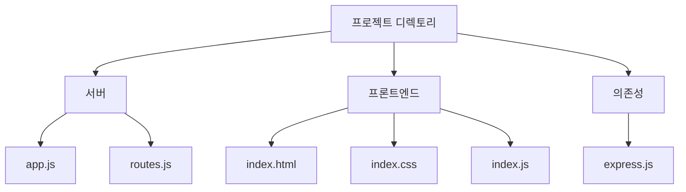
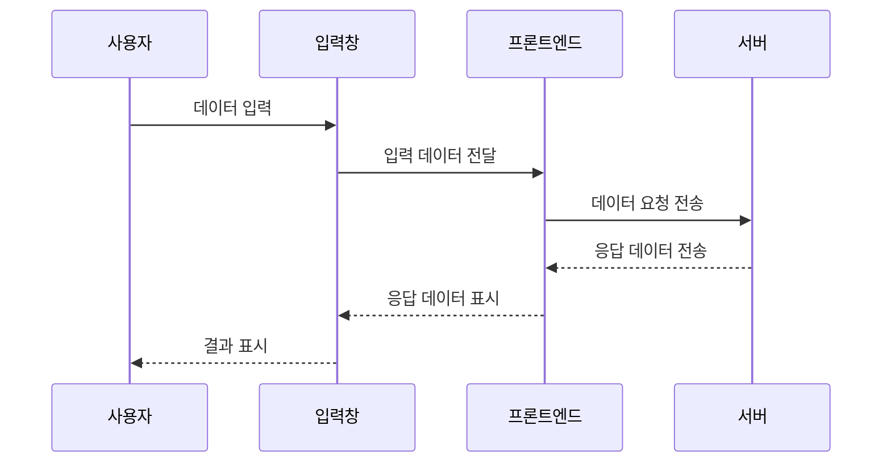

# PromptMake
chat GPT의 형태를 제작( express.js 활용 )

# Web Application IA

# **기술 요구서**

### **기술 스택**

- **서버**: Node.js, Express.js
- **프론트엔드**: Vanilla JavaScript, CSS, HTML
- **데이터 저장**: JSON 파일

### **코어 파일 구성**

- **서버**:
    - **app.js**: Express.js 애플리케이션의 시작점
    - **routes.js**: HTTP 라우팅을 처리하는 파일
- **프론트엔드**:
    - **index.html**: 웹 페이지의 HTML 템플릿
    - index**.css**: 웹 페이지의 CSS 스타일
    - **index.js**: 웹 페이지의 JavaScript 코드

### **의존성**

- **express.js**



### **기초 데이터 (임의의 JSON 데이터)**

```json
jsonCopy code
{
  "header": {
    "hamburgerMenu": ["Home", "Profile", "Settings", "Logout"],
    "logo": "🌐",
    "promptInputPlaceholder": "Enter your message here..."
  },
  "mainContent": {
    "inputRecords": [
      {
        "type": "user",
        "message": "How does OpenAI work?",
        "timestamp": "10:23 AM"
      },
      {
        "type": "assistant",
        "message": "OpenAI is a machine learning model...",
        "timestamp": "10:24 AM"
      }
    ],
    "userInfo": {
      "name": "John Doe",
      "status": "Online",
      "avatar": "👤"
    }
  }
}

```

### **스타일 가이드 (JSON 형식)**

```json
jsonCopy code
{
  "colors": {
    "primary": "#FF5733",
    "secondary": "#33FF57",
    "background": "#F5F5F5",
    "text": "#333333"
  },
  "fonts": {
    "main": "Arial, sans-serif",
    "alternate": "Georgia, serif"
  },
  "icons": {
    "logo": "🌐",
    "userAvatar": "👤"
  }
}

```

### **주요 기능**

- **프롬프트 페이지**:
    - 상단에 로고 (이모지폰트)와 햄버거 메뉴 표시
    - 사용자 프롬프트 입력창 제공
    - 사용자의 메시지 입력 및 서버로의 데이터 전송 (POST 요청)
    - 서버로부터 받은 응답을 오른쪽 입력 기록창에 추가 (GET 요청)
    - 왼쪽 하단에 사용자 정보 (이름, 상태, 아바타 이미지) 표시
    - 입력받은 데이터를 임의의 JSON 파일에 데이터 저장
    



### **추가 미션**

- **에러 핸들링**
- **데이터 유효성 검사**
- **페이지네이션**
- **리팩토링**
